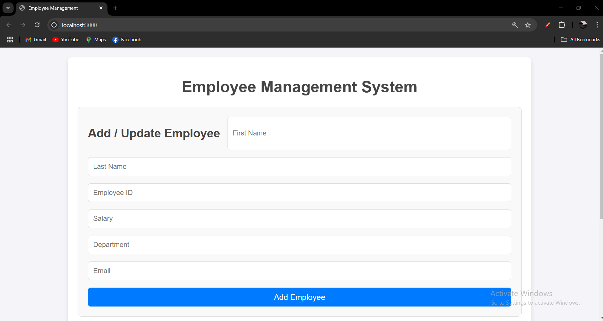

Bandana Pachabhaiya Magar
ID: C0916126

Employee Management System
This is a simple Node.js application to manage employee data using a JSON array as a database. The application allows users to add, update, and view employee information through a visually appealing web interface. It uses the MVC architecture and AJAX to interact with the server-side API.

Features
Add and update employee information.
View all employee records in a dynamic table.
User-friendly and responsive web interface.
Backend API built with Node.js and Express.
AJAX calls for seamless communication between frontend and backend.

Technologies Used
Frontend: HTML, CSS, JavaScript (AJAX)
Backend: Node.js, Express.js
Design: Responsive CSS for modern UI/UX.

Note: This is my local file if you want to check then click the link below
Installation
Clone the repository:
git clone https://github.com/bandanapm/EmployeeAddUpdateApp.git
cd EmployeeAddUpdateApp

Install dependencies:
npm install

Start the server:
node app.js

Open the application in your browser:
http://localhost:3000/

API Endpoints
The backend exposes two main API endpoints:

POST /api/employees
Adds or updates an employee in the database.

Request Body (JSON):
{
  "firstName": "Bandana",
  "lastName": "Pachabhaiya Magar",
  "id": "1",
  "salary": 50000,
  "working_department": "HR",
  "email": "b.m@example.com"
}

Response:
{
  "message": "Employee added/updated successfully."
}

GET /api/employees
Retrieves all employee records.
[
  {
    "firstName": "Bandana",
    "lastName": "Pachabhaiya Magar",
    "id": "1",
    "salary": 50000,
    "working_department": "HR",
    "email": "b.m@example.com"
  }
]

Usage Instructions
Add or Update an Employee:
Fill in the employee details in the form.
Click the Add / Update Employee button to save the data.

View Employees:
The employee records will be displayed in a table below the form.
Click the Update button next to a record to pre-fill the form for editing.

Project Folder Structure
Bandana_Pachabhaiya_Magar_A5/
│
├── controllers/    # API logic (routes)
│   └── employeeController.js
├── models/         # Data model for employees
│   └── employee.js # Handles the "database"
├── node_modules/
├── public/         # Static files (HTML, CSS, JS)
│   ├── index.html  # UI for employee input
│   └── script.js   # AJAX logic
├── views/          # Views folder (optional, for templating engines)
├── package-lock.json
├── package.json    # Node.js configuration
├── README.md       # Readme file
└── server.js       # Main entry point

Screenshot
Employee Management System UI

Future Improvements
Add employee search functionality.
Integrate a real database (e.g., MongoDB, MySQL).
Add user authentication and authorization.
Contributing
Contributions are welcome! Please submit a pull request or open an issue for any bugs or suggestions.

License
This project is licensed under the MIT License.

